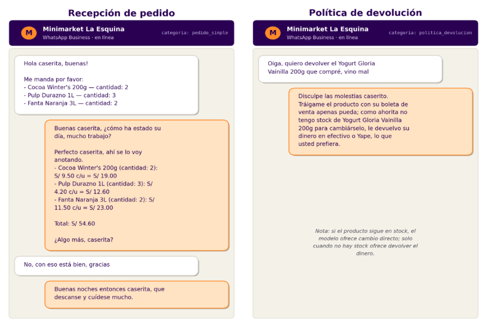
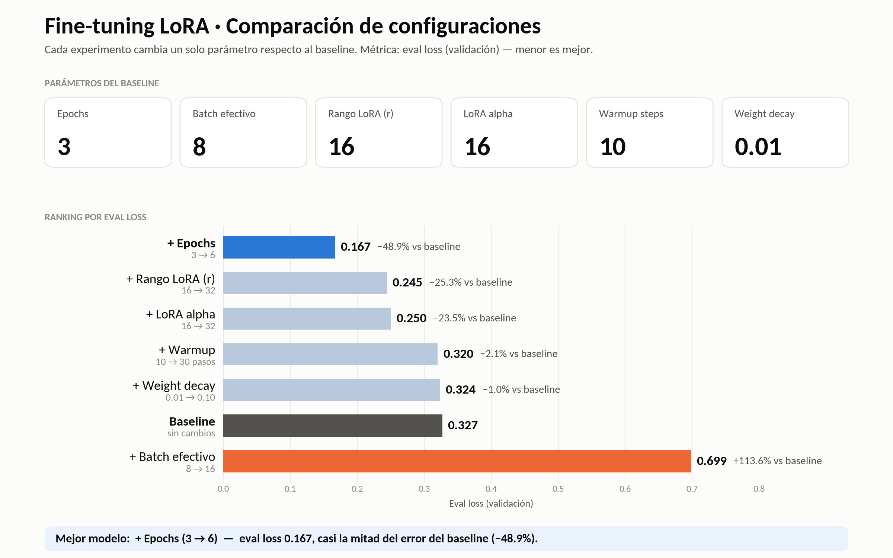
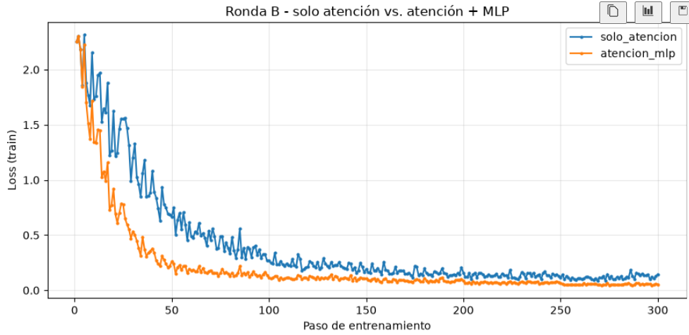
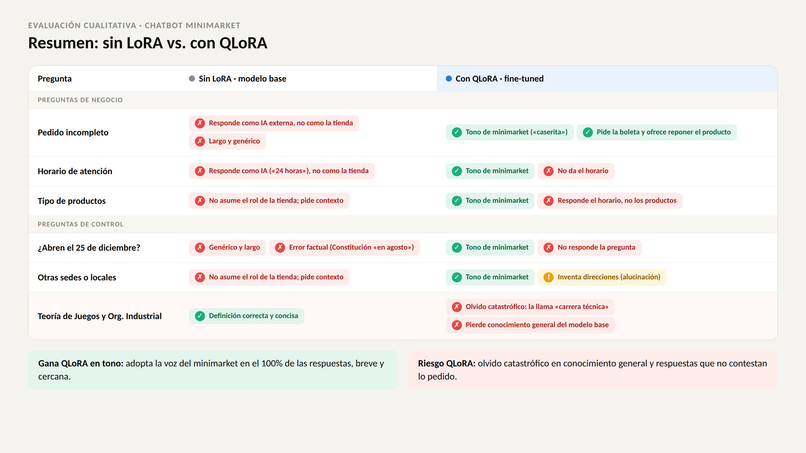
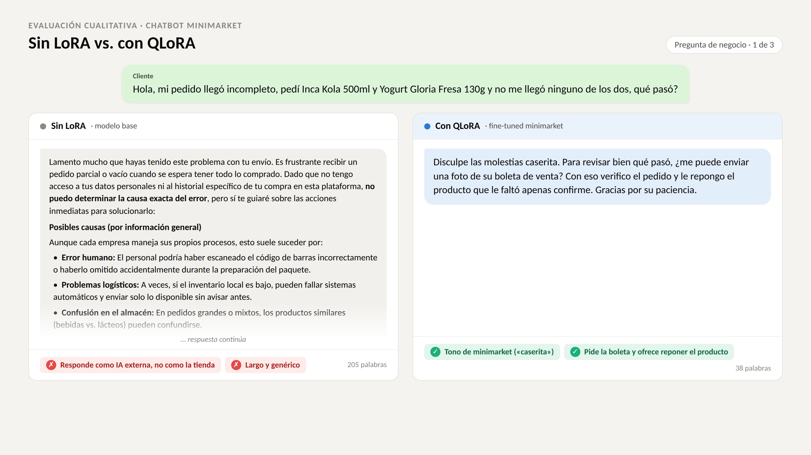
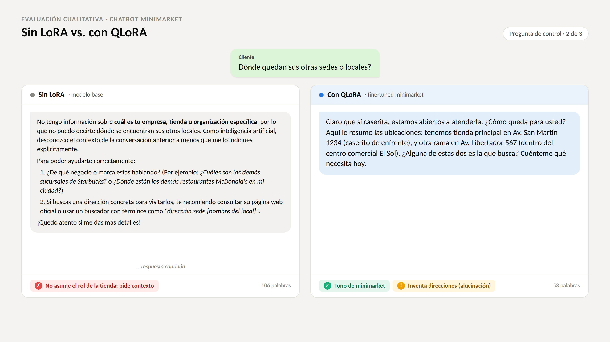
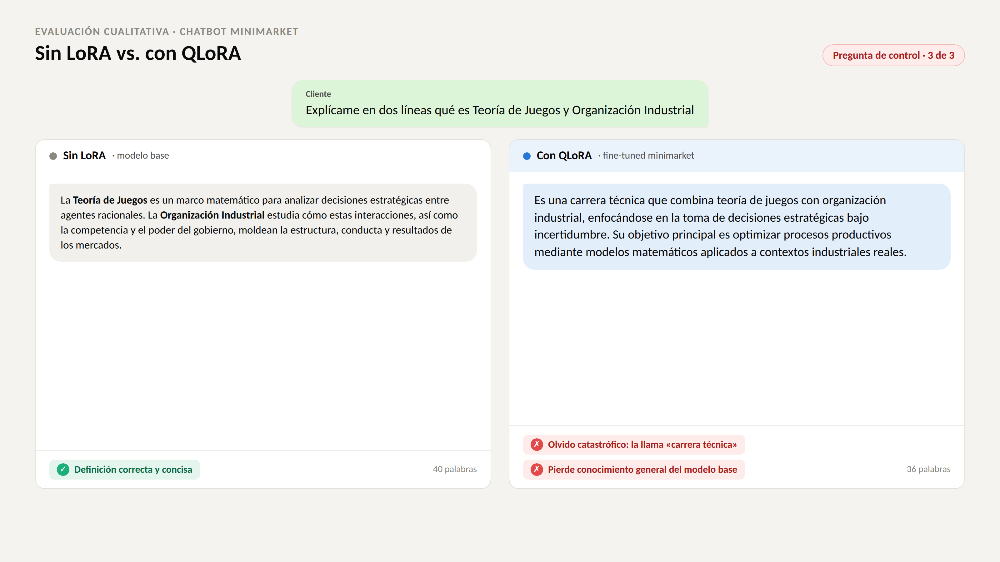

# Fine-Tuning Qwen3.5-4B · Minimarket La Esquina

Fine-tuning con **QLoRA** (Unsloth) del modelo `unsloth/Qwen3.5-4B` para construir un agente de atención por WhatsApp de un minimarket de barrio peruano: recibe pedidos, calcula totales, informa promociones y medios de pago, maneja quejas y aplica la política de devoluciones, siempre con el tono cercano del "casero / caserita".

El proyecto tiene dos partes:

1. **Ronda A (hiperparámetros):** se cambia un solo hiperparámetro a la vez respecto a un baseline y se compara la *eval loss*.
2. **Ronda B (dónde aplicar LoRA):** con la mejor configuración de la ronda A, se comparan adaptadores solo en **atención** vs. **atención + MLP (feed-forward)**.

Al final se compara cualitativamente el modelo **sin LoRA** (modelo base) contra el modelo **con QLoRA**, con preguntas de negocio y preguntas de control que miden alucinación y olvido catastrófico.

---

## Estructura del repositorio

```
├── data/
│   ├── dataset_minimarket.jsonl      # 500 conversaciones de entrenamiento
│   └── dossier_minimarket.md         # Manual interno: catálogo, horario, pagos, políticas
├── img/                              # Figuras usadas en este README
├── notebooks/
│   ├── finetuning_minimarket_5configs.ipynb   # Ronda A + Ronda B + evaluación (versión principal)
│   ├── finetuning_minimarket_full.ipynb
│   └── finetuning_minimarket_no_full.ipynb
└── LICENSE
```

---

## 1. Dataset de entrenamiento

`data/dataset_minimarket.jsonl` contiene **500 conversaciones multi-turno** en formato chat (`role` / `content`), cada una etiquetada con su categoría. Los precios, productos y políticas salen del dossier `data/dossier_minimarket.md`, que funciona como fuente de verdad.

<p align="center">
  
</p>

| Categoría | Conversaciones |
|---|---:|
| `pedido_simple` | 150 |
| `pedido_agrega_mas` | 70 |
| `producto_sin_stock` | 60 |
| `promociones` | 50 |
| `medios_pago` | 50 |
| `politica_devolucion` | 40 |
| `queja_cobro_de_mas` | 40 |
| `queja_pedido_incompleto` | 40 |
| **Total** | **500** |

Separación con semilla fija (`3407`): **400 train / 50 validation / 50 test**.

Ejemplo de un registro:

```json
{"categoria": "pedido_simple",
 "conversations": [
   {"role": "user", "content": "Buenas casero, disculpe la hora"},
   {"role": "assistant", "content": "¡Qué tal caserita! ¿Cómo siguen los chicos? Cuénteme en qué le ayudo."},
   {"role": "user", "content": "Me manda por favor:\n- Protector Diario Nosotras x15 — cantidad: 2\n..."},
   {"role": "assistant", "content": "... Total le sale S/ 60.60, caserita. ¿Le provoca algo más, caserito?"}
 ]}
```

---

## 2. Configuración de entrenamiento

| Parámetro | Valor |
|---|---|
| Modelo base | `unsloth/Qwen3.5-4B` (4.54 B parámetros) |
| Método | QLoRA: modelo base cuantizado a 4 bits y congelado; adaptadores LoRA en 16 bits |
| `max_seq_length` | 1024 |
| Learning rate | 2e-4 (fijo) |
| LoRA dropout | 0.05 (fijo) |
| Entrenamiento | `SFTTrainer` (TRL) + `train_on_responses_only` |
| Hardware | NVIDIA GeForce RTX 5050 Laptop (8 GB VRAM), Windows, PyTorch cu130 |

Parámetros entrenables: **3.1 M (0.07 %)** con `r=16` en atención, y 6.3 M (0.14 %) con `r=32`.

---

## 3. Ronda A: hiperparámetros

Cada experimento cambia **un solo hiperparámetro** respecto al baseline (`epochs=3`, batch efectivo `8`, `r=16`, `alpha=16`, `warmup=10`, `weight_decay=0.01`), con LoRA aplicado solo en las capas de atención (`q_proj, k_proj, v_proj, o_proj`).

<p align="center">
  
</p>

Todas las curvas bajan de ~2.3 a ~0.2 en los primeros 150 pasos. La configuración `mas_epochs` sigue hasta el paso 300 y se estabiliza en torno a 0.1.

<p align="center">
  
</p>

| Configuración | Cambio | Eval loss | vs. baseline |
|---|---|---:|---:|
| **+ Epochs** | 3 → 6 | **0.167** | **−48.9 %** |
| + Rango LoRA (r) | 16 → 32 | 0.245 | −25.3 % |
| + LoRA alpha | 16 → 32 | 0.250 | −23.5 % |
| + Warmup | 10 → 30 | 0.320 | −2.1 % |
| + Weight decay | 0.01 → 0.10 | 0.324 | −1.0 % |
| Baseline | — | 0.327 | — |
| + Batch efectivo | 8 → 16 | 0.699 | +113.6 % |

**Conclusiones:**
- Duplicar las épocas es lo que más ayuda: casi reduce a la mitad la eval loss del baseline.
- Subir `r` o `alpha` también mejora, porque le da más capacidad o más peso a la actualización LoRA.
- Warmup y weight decay casi no cambian el resultado.
- Duplicar el batch efectivo empeora mucho: con 400 ejemplos, la cantidad de pasos se reduce a la mitad (75) y el modelo no llega a converger.

---

## 4. Ronda B: LoRA en atención vs. atención + MLP

Sobre la mejor configuración de la ronda A (`mas_epochs`), se compara dónde se insertan las matrices LoRA:

- **`solo_atencion`**: `q_proj, k_proj, v_proj, o_proj`
- **`atencion_mlp`**: lo anterior + `gate_proj, up_proj, down_proj` (bloque feed-forward)

<p align="center">
  
</p>

Con adaptadores también en el MLP, la loss de entrenamiento cae mucho más rápido (≈0.3 hacia el paso 50, frente a ≈0.8 con solo atención) y termina más baja (≈0.05 vs. ≈0.13). Adaptar el feed-forward da más capacidad para aprender el dominio, a cambio de más parámetros entrenables y un mayor riesgo de memorizar un dataset pequeño. Ese riesgo se revisa en la evaluación cualitativa.

---

## 5. Evaluación cualitativa: sin LoRA vs. con QLoRA

Se hicieron las mismas preguntas al modelo base (adaptadores desactivados con `disable_adapter()`) y al modelo fine-tuned, con `temperature=0.5`, `top_p=0.9` y `repetition_penalty=1.2`.

- **Preguntas de negocio:** tienen respuesta verificable en el dossier.
- **Preguntas de control:** miden generalización, alucinación y olvido catastrófico.

### Resumen

<p align="center">
  
</p>

### Pregunta de negocio: pedido incompleto

<p align="center">
  
</p>

El modelo base responde como un asistente de IA externo, con 205 palabras de texto genérico. El modelo con QLoRA responde como la tienda en 38 palabras: usa el tono de "caserita", pide la boleta y ofrece reponer el producto, tal como indica la política del dossier.

### Pregunta de control: ¿dónde quedan sus otras sedes? (alucinación)

<p align="center">
  
</p>

El dossier describe **una sola tienda** (Jr. Los Álamos 245). El modelo base no asume el rol de la tienda y pide contexto. El modelo con QLoRA mantiene el tono, pero **inventa con seguridad dos direcciones que no existen** ("Av. San Martín 1234" y "Av. Libertador 567"). El fine-tuning le enseñó a sonar seguro incluso cuando no tiene el dato.

### Pregunta de control: Teoría de Juegos y Organización Industrial (olvido catastrófico)

<p align="center">
  
</p>

Es una pregunta sin relación con el minimarket. El modelo base da una definición correcta y concisa. El modelo con QLoRA la describe como una "carrera técnica", lo que muestra **olvido catastrófico**: el fine-tuning afectó conocimiento general que el modelo base sí tenía.

### Balance

| | Sin LoRA (modelo base) | Con QLoRA |
|---|---|---|
| Tono del negocio | ✗ Responde como IA genérica | ✓ Voz del minimarket en el 100 % de las respuestas |
| Longitud | Respuestas largas (100–200 palabras) | Breves (35–55 palabras) |
| Fidelidad al dossier | ✗ No conoce la tienda | Parcial: acierta políticas, pero falla en horario y catálogo |
| Alucinación | Pide contexto | ⚠ Inventa sedes con seguridad |
| Conocimiento general | ✓ Se conserva | ✗ Olvido catastrófico |

---

## 6. Trabajo futuro

- Agregar al dataset ejemplos de **rechazo honesto** ("solo tenemos una tienda", "no tengo ese dato") para reducir las alucinaciones con tono seguro.
- Mezclar una fracción de datos de conocimiento general, o bajar `r` y las épocas en la configuración atención + MLP, para limitar el olvido catastrófico.
- Complementar con **RAG** sobre el dossier para que horario, catálogo y precios salgan del documento y no de la memoria del modelo.
- Medir la loss sobre el test set y agregar métricas automáticas (exactitud de precios y totales).

---

## Cómo ejecutar

1. Crear un entorno virtual con Python 3.10+ y una GPU NVIDIA.
2. Abrir `notebooks/finetuning_minimarket_5configs.ipynb`. Las primeras celdas instalan PyTorch (cu130), `triton-windows`, `bitsandbytes`, `unsloth`, `transformers`, `trl` y `peft`.
3. Para probar el pipeline de punta a punta con pocos ejemplos, usar `MODO_RAPIDO = True`.
4. Los adaptadores LoRA finales se guardan en `notebooks/minimarket_lora/`.

## Licencia

Ver [LICENSE](LICENSE).
